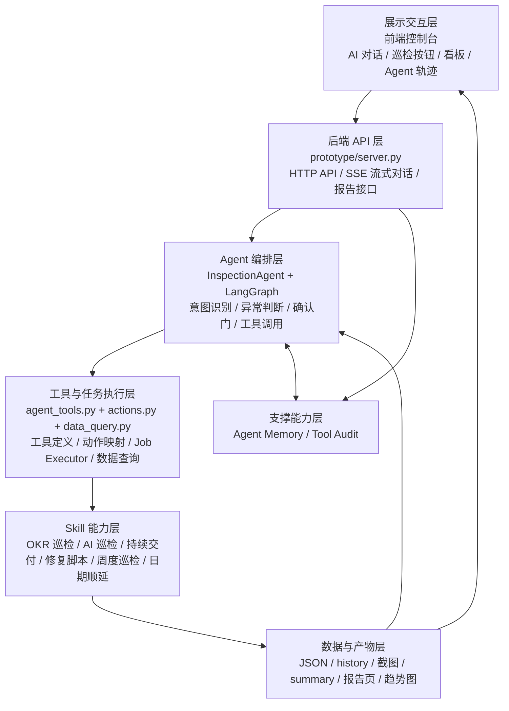
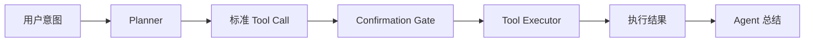

# 收银台&内单交易域巡检 Agent

这是一个基于 LangGraph 的巡检 Agent 系统，用来统一承接日常巡检、周度巡检、延期需求修复、计划日期顺延、报告生成、数据问答和过程审计。

项目不是单一 skill，而是一个 Agent 应用。底层多个巡检 / 修复 skill 提供具体执行能力，InspectionAgent 负责判断用户意图、编排工具调用、管理上下文，并通过前端控制台提供对话、看板、任务状态和 Agent 轨迹。

## 当前能力

- 日常巡检：延期提测、延期上线、技术改造工时占比、双周交付率、AI 非深度用户、持续交付。
- 周度巡检：抓取周度 INE 指标并生成周度报告。
- 自动修复：延期提测、延期上线命中待修复需求时，可执行修复脚本并回填负责人、链接和修复结果。
- 计划日期顺延：将命中本周四的计划提测 / 上线日期顺延至本周五。
- 模板总结：巡检完成后可按固定模板输出日常巡检总结，异常指标自动标记。
- 数据问答：Agent 可以查询本地巡检 JSON、AI 明细、修复历史、周度数据和报告产物。
- 失败恢复：巡检步骤支持自动重试，部分失败时继续后续步骤，并输出失败位置和完成情况。
- Agent 轨迹：记录 Planner、Evaluator、确认门、工具调用、数据查询、执行结果等审计信息。
- Agent Memory：压缩保存最近动作、会话摘要、异常项和修复记录，支持跨轮对话。

## 快速启动

项目运行使用 `xunjian` 虚拟环境。

```bash
cd "/Users/gaojingqi.5/Desktop/JD.com xunjian"
PYTHONPYCACHEPREFIX=/private/tmp/jd-xunjian-pycache \
/Users/gaojingqi.5/miniconda3/envs/xunjian/bin/python prototype/server.py
```

启动后访问：

```text
http://127.0.0.1:8765
```

默认端口是 `8765`。如果端口已被占用，需要先停止旧进程：

```bash
lsof -ti tcp:8765
kill <pid>
```

## 目录结构

```text
.
├── prototype/                         # Agent 后端、前端控制台、工具审计和记忆
│   ├── server.py                      # HTTP API、模型调用、报告接口
│   ├── inspection_agent.py            # InspectionAgent / LangGraph 编排层
│   ├── agent_tools.py                 # Tool Calling 标准化
│   ├── actions.py                     # Action Registry / Action Executor
│   ├── data_query.py                  # 只读本地数据查询工具
│   ├── agent_memory.py                # Agent Memory 压缩记忆
│   ├── tool_audit.py                  # Agent 轨迹审计日志
│   ├── templates/                     # 巡检总结模板
│   ├── static/                        # 前端页面、样式和脚本
│   └── data/                          # 会话、模型配置、记忆、审计数据
├── daily-inspection-skill/            # 日常巡检 skill 集合
│   ├── OKR-inspection/                # OKR 四项巡检
│   ├── AI-inspection/                 # AI 非深度用户巡检
│   ├── ContinuousDelivery-inspection/ # 持续交付巡检
│   ├── reschedule-delayed-test /      # 延期提测修复
│   ├── repair-delayed-launch/         # 延期上线修复
│   └── joyclaw-daily-inspection-orchestrator-skill/
│       └── out/weekly-inspection-summary.json
├── friday-inspection-skill/           # 周度巡检 skill
├── thursday-to-friday-adjustment/     # 计划日期顺延
├── index.html                         # 静态展示页
├── daily-report.html                  # 日常报告静态页
├── weekly-report.html                 # 周度报告静态页
├── repair-report.html                 # 修复报告静态页
└── thursday-report.html               # 日期顺延报告静态页
```

## 架构分层



## InspectionAgent 编排层

InspectionAgent 是系统的总控层，负责把用户输入转化为合适的 Agent 行为。它不直接执行脚本，也不直接解析所有业务数据，而是负责意图判断、流程分流和工具编排。

当前 InspectionAgent 基于 LangGraph 编排，主要分为两条路径：

- 执行型任务：日常巡检、周度巡检、修复延期提测、修复延期上线、刷新报告、计划日期顺延等。
- 问答型任务：查询具体指标、解释异常原因、查看某个人的 AI 提交占比、追问报告内容等。

当前 LangGraph 节点包括：

- `load_context`：加载当前对话、历史消息、巡检 summary、Agent memory，并进行初步规则识别。
- `scope_guard`：判断用户请求是否需要进入巡检 Agent 语境。现在它不再简单拒绝非巡检问题，而是允许普通问答继续流转。
- `planner`：判断用户意图，决定本轮是回答问题，还是调用巡检、修复、报告刷新等工具。
- `evaluator`：基于当前巡检 summary 和阈值规则判断是否异常，识别是否需要修复、刷新报告或人工介入。
- `confirmation_gate`：对修复延期提测、修复延期上线、计划日期顺延等写操作增加确认门，避免 Agent 未经确认修改线上数据。
- `tool_node`：执行标准化工具调用，把 Agent 决策转换为具体动作，并记录工具调用结果。

问答型任务会进入只读数据查询能力。大模型可以通过 `query_inspection_data` 工具查询本地巡检 JSON、AI 巡检明细、修复历史、周度数据和报告产物，再基于查询结果生成回答。

## Tool Calling 标准化

Tool Calling 标准化负责把系统能力从零散脚本调用抽象成 Agent 可理解、可选择、可审计、可扩展的工具体系。

每个 Tool 都有统一结构：

- `name`：工具名称，例如 `run_daily_inspection`、`run_repair_delayed_test`、`query_inspection_data`。
- `action`：业务动作标识，例如 `daily_inspection`、`repair_delayed_test`。
- `description`：工具能力说明，帮助模型理解什么时候调用。
- `parameters`：工具入参 schema，用于约束模型传参。
- `risk`：工具风险等级，区分只读工具和写操作工具。
- `confirm_phrase`：写操作需要的确认短语。

标准化调用流程：



这样 Agent 不需要关心某个脚本具体怎么启动，只需要生成标准工具调用。后端根据 `tool_call.name` 找到对应 action，再由执行器统一调度脚本。

## Action Executor 执行器

Action Executor 是 Agent 和 skill 脚本之间的执行桥梁，负责把标准化 action 转换为可运行任务，并提供任务状态、步骤日志、自动重试和失败恢复能力。

每个 action 在 `prototype/actions.py` 中统一注册，包括：

- `title`：动作名称。
- `group`：动作分类，例如主流程、单项巡检、报告、修复、日期调整。
- `description`：动作说明。
- `risk`：风险等级。
- `confirm_phrase`：写操作确认短语。
- `steps`：实际执行的脚本步骤。

任务执行状态包括：

- `queued`：任务已排队。
- `running`：任务执行中。
- `success`：全部成功。
- `partial`：部分步骤失败，但允许继续执行。
- `failed`：任务失败。
- `timeout`：任务超时。

日常巡检会依次执行：

1. 延期提测率巡检
2. 延期上线率巡检
3. 技术改造工时占比巡检
4. 双周交付率巡检
5. AI 深度用户巡检
6. 持续交付巡检
7. 生成日常巡检报告

其中巡检步骤支持失败后自动重试，单项失败不会立即中断全部流程，最终由 Agent 汇总失败位置、完成情况和下一步建议。

## Skill 关系

本项目不是单一 skill，而是一个基于 LangGraph 的巡检 Agent 系统。系统底层复用了多个巡检 skill 和修复 skill，并通过 Tool Calling 标准化将这些 skill 封装为 Agent 可调用的工具能力。

分工如下：

- Skill：具体怎么做，负责打开页面、筛选数据、抓取表格、修改字段、生成 JSON 和截图。
- Tool：把 skill 包装成 Agent 可调用的标准工具。
- InspectionAgent：决定什么时候调用哪个工具。
- Evaluator：根据结果判断是否异常、是否需要修复或刷新。
- 前端控制台：让用户触发、查看结果、查看轨迹。

一句话总结：

> Skill 是底层能力，Tool Calling 是标准接口，InspectionAgent 是调度大脑。

## 数据问答工具

`prototype/data_query.py` 提供只读本地数据查询工具 `query_inspection_data`。

它会检索本地巡检产物，包括：

- 日常巡检 summary：`weekly-inspection-summary.json`
- AI 巡检明细：`AI-inspection/out/non_deep_users_*.json`
- 持续交付数据
- 周度巡检数据
- 修复历史 JSON
- 日期顺延 JSON

用户可以问：

- `王佳斌的 AI 代码提交率是多少`
- `延期上线需求有哪些负责人`
- `持续交付占比是多少`
- `双周交付率最新是多少`
- `今天有哪些异常指标`

Agent 会先调用只读数据查询工具，再基于命中结果回答。调试时可以在 Agent 轨迹里看到 `data_query_requested` 和 `data_query_completed`。

## 巡检异常规则

当前日常巡检异常判断规则：

- 延期提测需求数：需要修复的需求数大于 `0` 视为异常。
- 延期上线需求数：需要修复的需求数大于 `0` 视为异常。
- 双周交付率：低于 `50%` 视为异常。
- 技术改造工时占比：高于 `10%` 视为异常。

异常指标会在日常巡检模板中用警示标识标注。正常指标保持正常标识。

## 前端控制台

前端位于 `prototype/static/`，入口由 `prototype/server.py` 提供。

主要视图：

- 巡检看板：展示核心指标、趋势图、截图和报告入口。
- AI 对话：自然语言触发巡检、查询数据、追问报告。
- 任务面板：展示当前 Job 状态、步骤日志、失败信息。
- Agent 轨迹：展示 Planner、Evaluator、确认门、工具调用、数据查询等事件。
- 功能中心：提供常用动作快捷入口。

## API 概览

常用接口：

```text
GET  /api/summary              # 当前巡检汇总
GET  /api/actions              # 可用 action 和 tool
GET  /api/tools                # 标准工具定义
GET  /api/tools/audit          # Agent 轨迹
GET  /api/jobs                 # 任务列表
GET  /api/ai-config            # 模型配置状态

POST /api/chat                 # 普通对话
POST /api/chat/stream          # SSE 流式对话
POST /api/actions/run          # 执行动作
POST /api/tools/call           # 标准工具调用
POST /api/tools/audit/clear    # 清空 Agent 轨迹
POST /api/jobs/clear           # 清空任务
POST /api/public-site/sync     # 同步静态展示页

GET  /reports/daily            # 日常报告
GET  /reports/weekly           # 周度报告
GET  /reports/repair           # 修复报告
GET  /reports/thursday         # 日期顺延报告
```

## 调试方式

### 1. 判断为什么没有执行工具

打开前端的 Agent 轨迹，查看：

- `planner_completed`：Planner 判断的 `action` 是什么。
- `plan.plan_type`：是 `answer_only` 还是 `tool_execution`。
- `tool_call`：是否生成了标准工具调用。

如果用户只是问数据或解释问题，正常应该是 `answer_only`。

### 2. 判断为什么写操作没执行

查看 Agent 轨迹：

- 如果出现 `confirmation_required`，说明被确认门拦截。
- 检查 `required_phrase`，用户需要输入对应确认短语。

例如：

- 修复延期提测：`确认修复延期提测`
- 修复延期上线：`确认修复延期上线`
- 日常巡检自动修复：`确认执行修复`
- 计划日期顺延：`确认执行日期调整`

### 3. 判断为什么数据问答没命中

查看 Agent 轨迹里的数据查询事件：

- `data_query_requested`：模型请求了什么查询。
- `data_query_completed`：查询命中多少条。
- `matches`：命中的来源、路径、字段和值。

排查规则：

- `match_count = 0`：数据源未纳入，或字段别名未覆盖。
- `match_count > 0` 但回答错：模型总结阶段有问题。
- 没有数据查询事件：Planner / 模型没有判断这是数据查询问题。

### 4. 判断脚本执行失败

查看任务面板或 `/api/jobs`：

- `step_results`：每一步的状态。
- `stdout_tail` / `stderr_tail`：脚本输出尾部日志。
- `retry_limit`：是否支持重试。
- `continue_on_failure`：失败后是否继续后续步骤。

## Agent Memory

Agent Memory 位于 `prototype/data/agent-memory.json`。

当前采用规则压缩，不保存完整长对话，而是保存：

- 最近一轮用户输入和 Agent 动作。
- 最近一次巡检结果。
- 当前未关闭异常项。
- 每个会话的短摘要。
- 最近修复记录。

压缩策略：

- 文本截断。
- 字段筛选。
- 数量上限。
- prompt 阶段只传入摘要视图。

这样可以避免对话变多后上下文无限增长。

## Tool Audit

Tool Audit 位于 `prototype/data/tool-audit.jsonl`。

记录内容包括：

- Planner 决策
- Evaluator 结果
- 确认门拦截
- 工具入队
- 工具完成
- 工具拒绝
- 数据查询请求
- 数据查询结果

前端 Agent 轨迹面板会读取该日志用于展示。

## Failure Records

失败记录位于 `prototype/data/failure-records.jsonl`，可通过 `GET /api/failures` 查看最近 100 条。

记录内容包括：

- 失败任务、失败步骤和执行动作
- 失败分类、失败原因和优化建议
- 重试次数、单步超时、返回码和日志尾部

## 后续规划

后续可以继续从以下方向增强：

- Planner 多步骤规划：自动拆解“巡检、判断、修复、刷新、总结”复合任务。
- 数据查询增强：支持更强字段别名、日期过滤、人员过滤、趋势查询和置信度。
- Evaluator 增强：支持趋势异常、组合指标、严重程度和优先级判断。
- 定时任务：每日自动巡检、周四日期顺延、周五周度巡检。
- 失败恢复：支持失败步骤单独重跑、错误码标准化、自动补偿。
- 权限控制：对高风险写操作增加白名单、快照、审计和回滚策略。
- 平台化：指标、阈值、模板、skill 和看板配置化，支持更多业务域复用。

## 注意事项

- 写操作必须经过确认门，不建议绕过确认短语。
- 周度巡检只在周五执行，计划日期顺延只在周四执行。
- 周四 / 周五固定周期数据只展示本周有效窗口内数据。
- 不要手动删除 `out/`、`history/` 和 `prototype/data/` 下正在被使用的产物。
- 如果页面数据显示异常，优先检查 `/api/summary`、Agent 轨迹和对应 skill 的输出 JSON。
